## Create a Project

First login/sign up to [http://platform.kata.ai/login](http://new-platform.katalabs.io/login)

And click on “Create Project” and fill in the form. Each project contains one bot design, one NL, and one CMS.
You will be directed to this page.

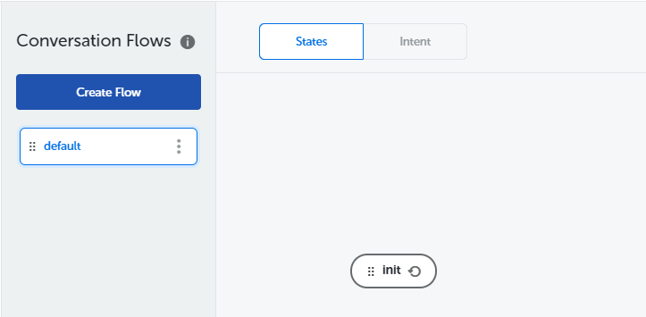

### Noted

You can try bot in Menu Test Chatbot (in the bottom right corner).

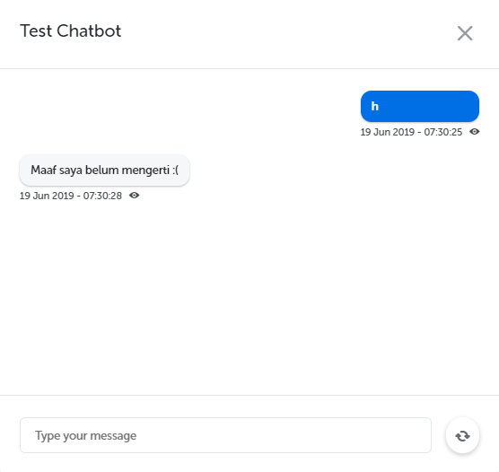

## Create a Hello Flow

### Create Flow

You may find a flow that is created automatically by the system or default flow. We will add a new flow called `helloFlow`. Set flow to active, and persistent.

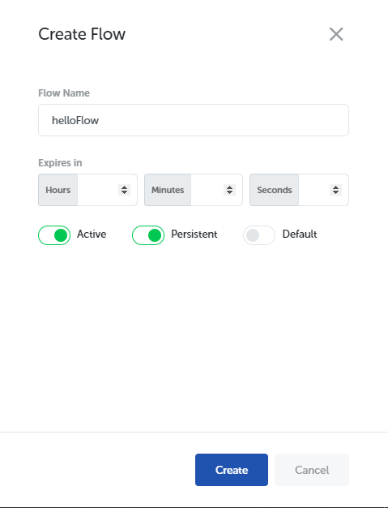

It will be shown like this.

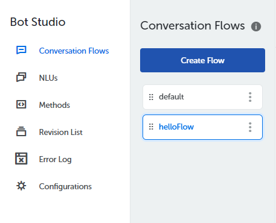

### Create keyword NLU for helloFlow

In this step, we will define the NLU (Natural Language Understanding) to trigger order flow. NLU is used to translate user inputs into data that machine can understand. There are many types of NLU, but the type that we will use in this particular flow is called keyword. To define the NLU, go to NLUs menu and create.

We will name it hello_NLU

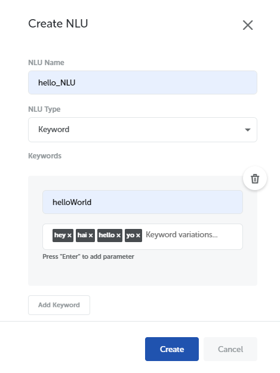

It will be shown like this.

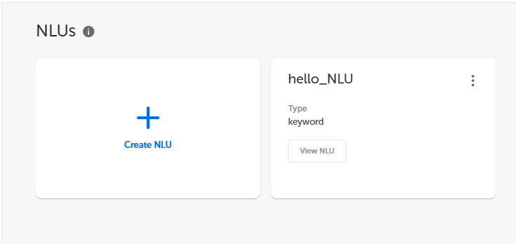

### Create Intent

Go back to Conversation flow menu and choose intent. Click on “+” button in Conversation Flow menu. Set the Intent name to `helloIntent` and choose option as initial.
Add a classifier and choose NLU that we create. We are gonna match it with `helloWorld` (keyword in NLU).

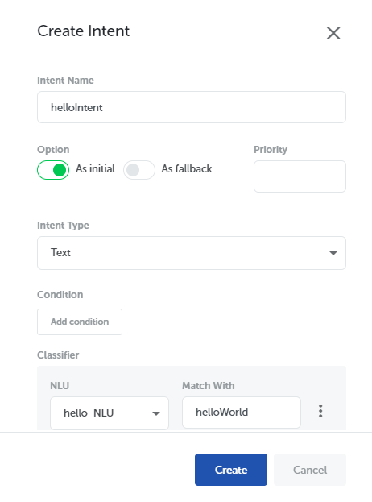
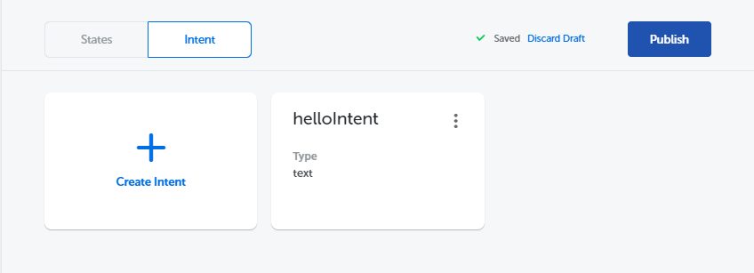

## Create action for showing Hello World

### Create State

Choose a states and click on "+" button. We will create a initial state. Set name to `init` and choose Initial State, and click create.

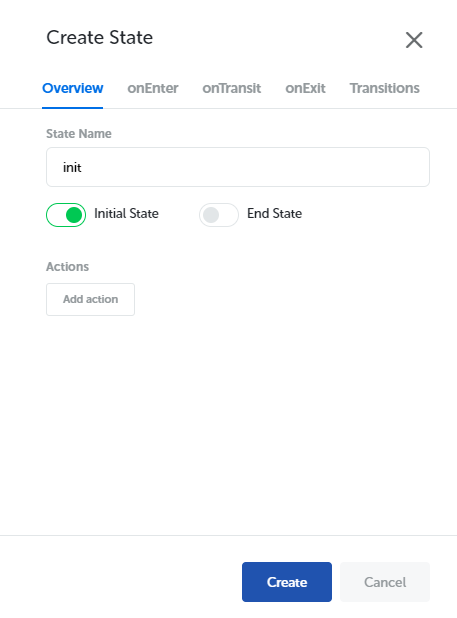

We will create another state for showing the response in our bot. Choose action to text.

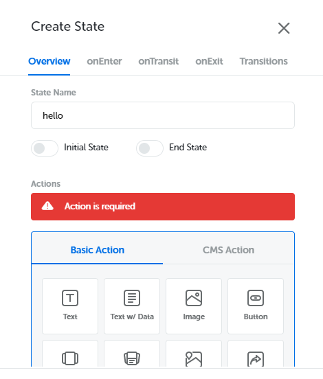

Add text response to Hello World!.

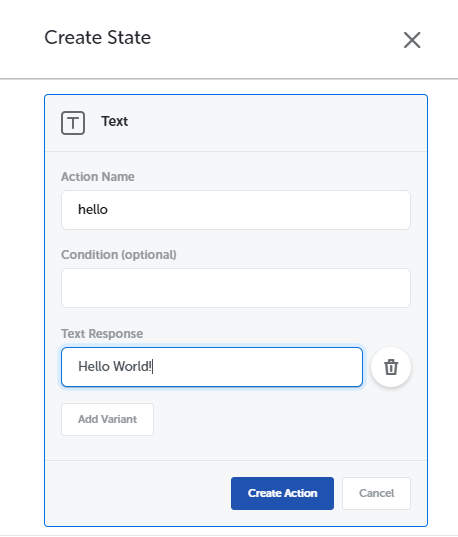

Action should be shown like this.

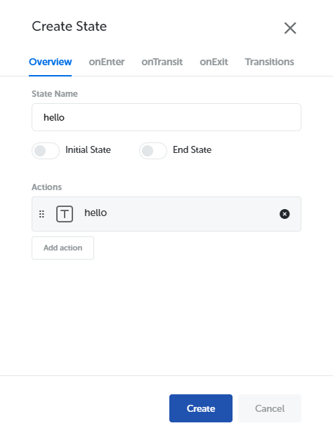

### Create Transation

Now, we will create a transition between two states that we have created before.

Click the green dot on `init` state, and a connector line will appear. Connect that line to `hello` state. If you do it right, a Create Transition form will appear.

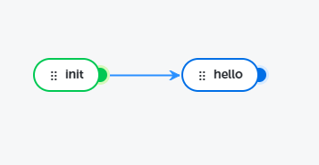

Set the condition to `intent=='helloIntent'` and click Create.

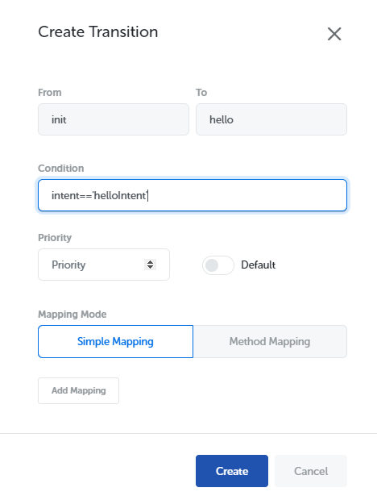

## Testing

Before this step don't forget to **Publish** your change. And then try your bot in Test Chatbot menu. Try to enter keyword that you define in NLU.

Viola! You have succeed build your first bot!

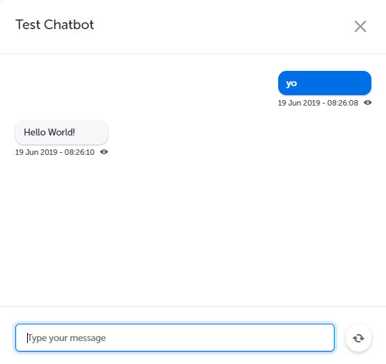
